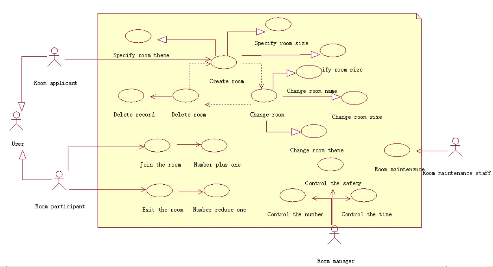
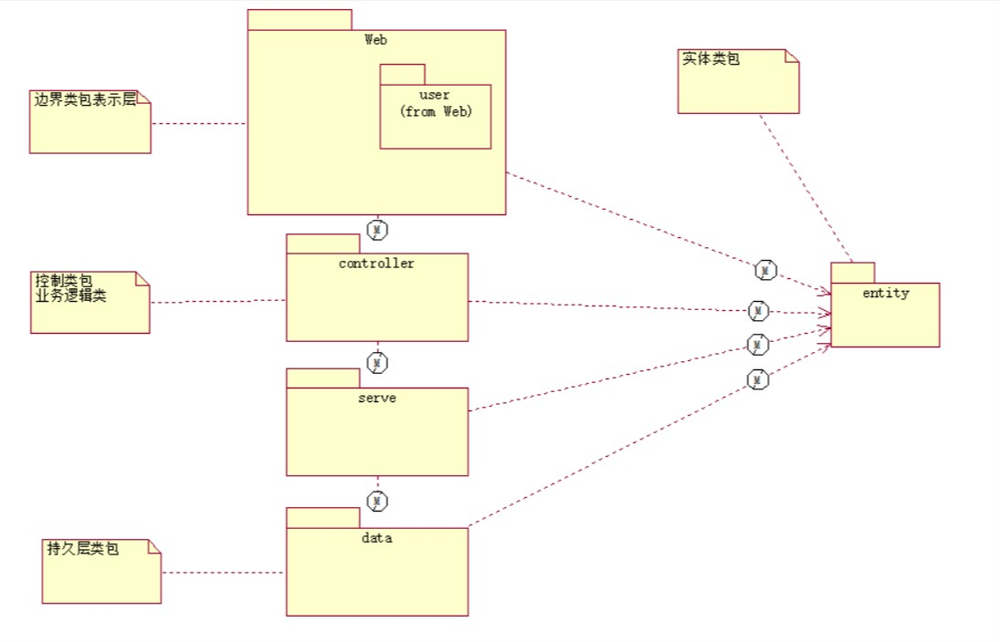
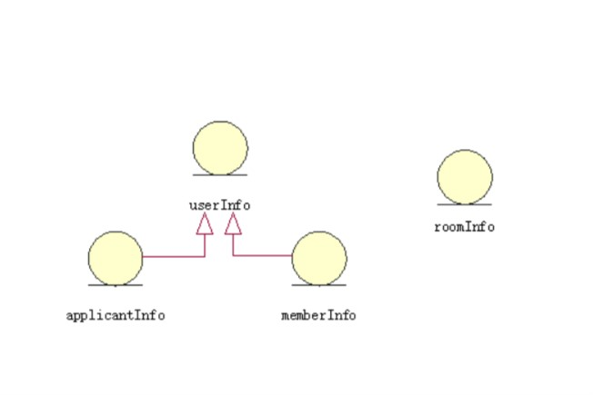
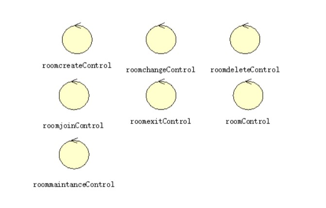
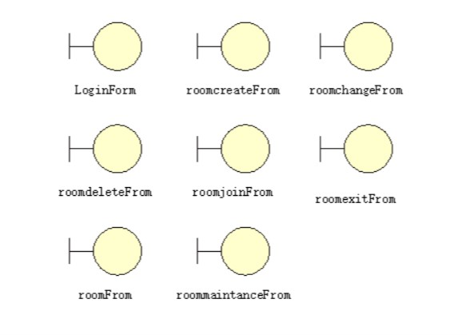
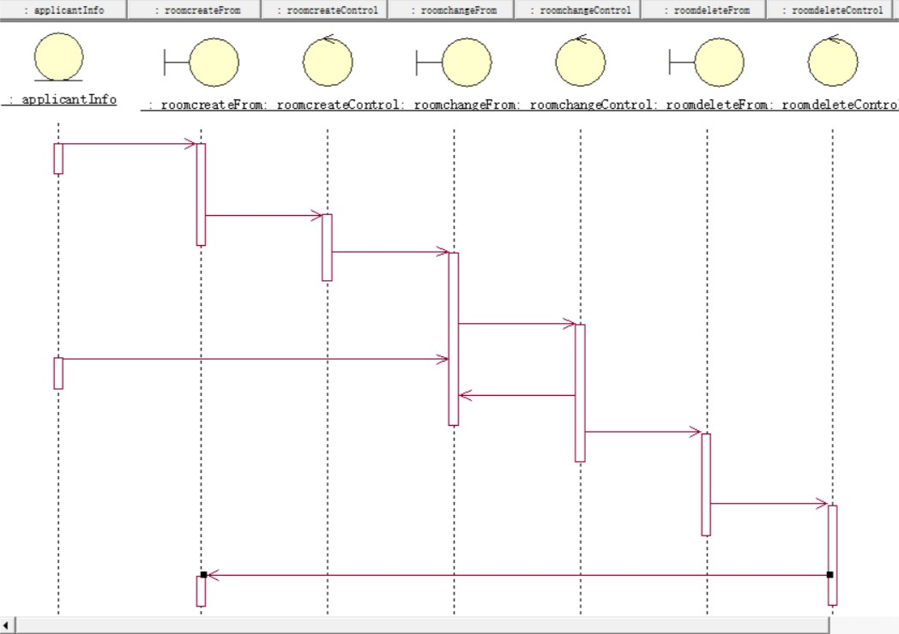
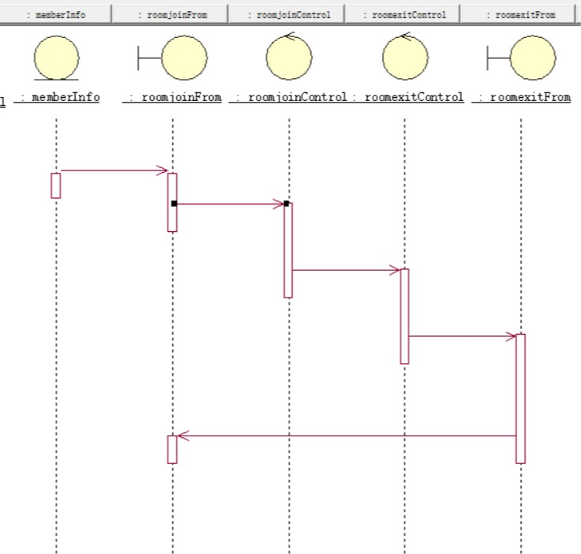
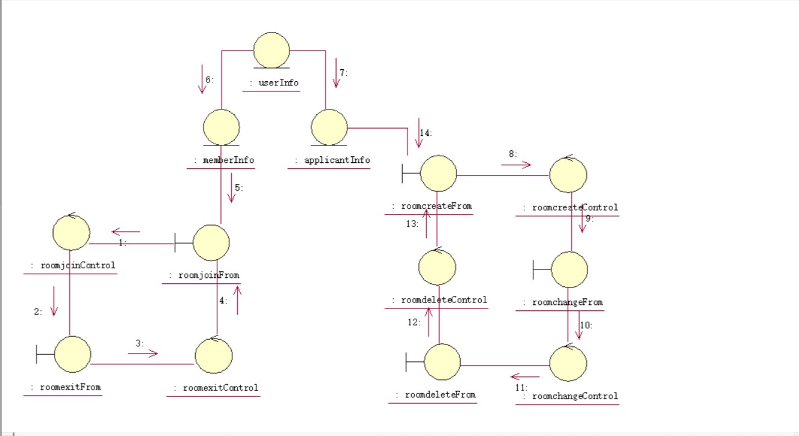

#排忧解难

---
#需求背景
心情不好的小红走到森林里面，发现了一个房子写着**忧去**二字。小红走进房子发现店员给自己带上了面具，房间里面有两扇门。一扇写着**为你排忧解难**，一扇门写着**为别人排忧解难**。小红推开第一扇门，看到九个人戴着面具围着桌子坐着，他们请小红坐在最中央的位置上询问她有什么忧虑或心事。小红把自己的心里话讲述给其余九个人，其余九个人经过激烈讨论，想出一个绝佳的方法解决小红的问题，小红很开心，道了谢后离开房间。收到他人帮助心情愉悦的她也想着为别人分忧解难，于是打开了第二扇门，坐在九张椅子中一张，很快椅子坐满，一个小男孩推开门，把他最近的心事向小红这一帮人诉说，小红和其余八个人马上开动脑筋为其想办法，最后小男孩也满带笑意的离开了。

这是一个**用户为用户**排忧解难、互相诉说心事的软件。为一些压力巨大或者心情不好、不想在现实中倾诉、想在网络上找到共鸣的朋友提供一个平台。所有用户匿名，ps:若是需要联系方式可以在聊天过程中自行获取。

#1、问题陈述
一个房子里面有若干个房间，每个房间里面有一张桌子，桌子旁摆放着几张椅子。
每个用户有两个选择：
* 进入房间，述说自己的忧虑，寻求别人帮助。
* 进入房间，主动帮助别人排除忧虑。

#2、建立用户模型
##2.1 识别角色
所有的用户在一开始都是普通用户，当用户有忧虑需要解决时，它就需要开辟一个空间供其使用，此时就产生了房间的主人（话题申请者）；当用户主动提出帮助他人时，它就变成了房间的客人（话题参与者）。除此之外还有房间的房东（据规定房间一共几个人、申请的时间控制、申请权力管控等功能）和修理工（房间的维护）
定义的角色如下：
* 房间申请者
* 房间参与者
* 房间管理人员
* 房间维护人员
##2.2 识别用例
**（一）、房间申请者**
* 申请房间
* 更改房间
* 删除房间

**（二）、房间参与者**
* 加入房间
* 退出房间

**（三）、房间管理人员**
* 规定房间人数
* 规定房间人员的安全性
* 规定申请时间

**（四）、房间维护人员**
* 房间的维护

---
###用例详解
用例1|申请房间
---|:--:
---|规定房间名称
---|规定房间主题
---|规定房间人数

用例2|更改房间
---|:--:
---|更改房间名称
---|更改房间主题
---|更改房间人数

用例3|删除房间
---|:--:
---|删除所有有关的信息
---|删除这个房间

用例4|加入房间
---|:--:
---|房间人数加一
---|参与话题讨论

用例5|退出房间
---|:--:
---|房间人数减一
---|离开话题讨论

用例6|控制房间人数
---|:--:
---|控制人数不多于约定的人数

用例7|控制房间人员的安全性
---|:--:
---|控制房间人员没有被拉入黑名单等不良行为

用例8|规定房间时间
---|:--:
---|控制申请的时间符合规定

用例9|房间维护
---|:--:
---|房间维护工作
#用例图展示

#3、建立类模型
##3.1房间类
属性：房间的名称、主题、规模（房间的人数）。

相关操作：增加房间、删除房间，修改房间的属性.......。

##3.2普通用户类
几乎所有注册的用户初始状态皆是普通用户，只是在不同情况下有不同的身份。

##3.3房间申请者类
用户本身有苦恼需要解决，所有需要申请房间，此时申请的主体用户便是房间申请者，同时作为房间的主人，他也有权利去修改一些房间的参数。
能够申请房间，删除房间，修改房间的主题、修改房间的大小、修改房间的可容纳人数。

##3.4房间参与者类
用户本身没有烦恼，但是热衷于为他人解决烦恼，此时就可以成为房间参与者。
房间参与者只能够参与或者退出，并没有任何修改的能力。
##3.4房间管理人员类
管控房间的人数等标准不受破坏
##3.5房间维护人员类
维护系统的正常运行
##3.6参与人员组类
将参与每个房间的人员各自组成一个组，更加便于管理和控制。

##3.7 RoomCriterion类
规定房间的准则(如人数，时间，人员性质)，

##3.8 RoomAdministration类
管理所有由用户创建的房间。
##3.9类之间的关系
* 泛化（Generalization）
* 实现（Realization）
* 关联（Association)
* 聚合（Aggregation）
* 组合(Composition)
* 依赖(Dependency)
####泛化
面向对象的一个重要思想概念——继承，继承是在现有类的基础上定义和实现一个新类的技术，刻画了类的一般性和特殊性。被继承的类称为父类或超类，继承的类称为子类。子类将父类作为自己的内容，并加入若干的新内容。子类继承父类的特性，特别是父类的属性和方法，通常，子类除了具有父类的属性和方法外，还有其它的属性和方法。
####实现
类和接口之间的关系就是实现关系，表示类实现接口提供的操作。
####关联
当两个类之间在概念上有连接关系时，类之间的连接成为关联，默认关联是双向的。
在Rose中，关联用一根连接类的实现表示，关联具有方向性，用箭头表示关联的方向。
####聚合
聚合是类之间的一种整体与部分的关系，也就是说，一个整体类是由多个部分类组成的。部分类和整体类之间存在的这种关系称为聚合，体现了一种层次结构。
####组合
也是整体与部分的关系，但是比聚合关系还要强，呈现为部分不能离开整体而单独存在。
####依赖
依赖是两个类之间的一种关系，其中一个类的变化将影响到另一个类。
类的依赖关系显示一个类引用另一个类。被引用的类的规范改变时可能会影响使用类
####各种关系的强弱顺序：

泛化 = 实现 > 组合 > 聚合 > 关联 > 依赖
#4、用例分析

##4.1识别实体类
实体类|说明
---|:--:
userInfo|普通用户的基本信息
applicantInfo|房间申请者基本信息
memberInfo|房间参与者基本信息
roomInfo|房间的基本信息

##4.2识别控制类
控制类|说明
---|:--:
roomcreateControl|负责房间创建
roomchangeControl|负责房间修改
roomdeleteControl|负责删除房间
roomjoinControl|负责加入房间
roomexitControl|负责退出房间
roomControl|负责管控房间
roommaintanceControl|负责维护房间

##4.3识别边界类
边界类|说明
---|:--:
LoginForm|注册用户进行登录的操作界面
roomcreateFrom| 房间创建的操作界面
roomchangeFrom| 房间修改的操作界面
roomdeleteFrom| 删除房间的操作界面
roomjoinFrom| 加入房间的操作界面
roomexitFrom| 退出房间的操作界面
roomFrom| 管控房间的操作界面
roommaintanceFrom| 维护房间的操作界面

##4.4定义交互行为
###顺序图（Sequence Diagram）
房间申请者：

房间参与者：

###协作图（Collaboration Diagram）

#rose实验报告
    Rational rose是一个面向对象的可视化建模软件。支持c++、java、vb等语言，此次实验中使用java。
    安装完可能无法启动，需要在环境变量里面自己配置一下，就是把common改成Common。
    
####Rose支持四种视图：
* 用例视图：use case view
* 逻辑视图：logical view
* 组件视图：component view
* 配置视图：deployment view

###1、用例视图
用例视图可以帮助你理解和使用系统，这个视图展示了系统和用例是怎么相互作用的。它包括系统中所有的用例。
这个视图默认生成一个名为main的Use Case图表。在这个视图，用户可以凭借图形直观的了解到用例和用例之间的作用关系。
###2、逻辑视图： 
我认为逻辑视图和用例视图不同，它更加关注系统如何实现项目的功能，比如说协作图、顺序图，呈现项目各个组件间如何关联。和它的名字一样，注重的是项目的逻辑结构。

我们可以在这个视图下建立Class diagram（类图）、Statechart diagram（状态图）Sequence Diagram（顺序图）、Collaboration Diagram（协作图）、Activity Diagram（活动图）。
这个视图也有默认生成的main ，效果的用例视图一致。
###3、组件视图： 
组件视图以代码的形式显示不同模块间的关系。我们通过组件视图可以知道哪些组件是代码库，哪些组件是运行组件。 
Component只包括Component（组件图）。
Component视图的main主要是用户用来管制代码的。

###4、部署视图： 
部署视图视图显示的进程和设备及其相互间的实际连接，它关注系统的实际部署，比如部署可能分成两层，界面的部署放在一台机器上，而业务和数据库逻辑的部署放在另外一台机器上。 
部署视图只包括Deployment视图。 
####除了四种视图，Rose还介绍了九种图：
用例图：Use Case Diagram
类图：Class Diagram
对象图：Object Diagram
状态图：State Diagram
顺序图：Sequence Diagram
协作图：Collaboration Diagram
组件图：Component Diagram
部署图：Deployment Diagram
活动图：Activity Diagram

#实验总结与心得

熟悉了Rose的各类图，实践了正向工程和反向工程。
了解需求分析的一系列必备操作。
动手实操，提高了自己独立思考问题的能力，结合上课所讲，在初步对自己的需求进行分析，收获匪浅。

正向工程：
我们基于tank大战的思维，利用类和用例等工具将目标项目以uml图的方式先存储在一个Rose的项目里，添加属性和方法，然后通过generate code ，可以生成自己想要的代码。 
老师为了让我们熟悉rose，先做了一遍正向工程，然后做了一遍反向工程。但是由于每个人画的图不一样，结构不一样，那么最后生成的代码也不一样。那么在做反向工程的时候就会有偏差，为了统一进度，老师事先准备了一份代码，这样就保证最后的结果一致同时可以检验对错（由于版本等一些问题，代码需要修改才可使用）。

反向工程：
反向就是和正向相反，从代码生成我们想要的类，我们选择的是java语言。首先我们需要编辑类路径Edit CLASSPATH，把我们准备的代码和Android包导入进去。然后选择Java/J2EE下的Reverse Engneer，找到所有的.java文件	，全部add，然后select all，reverse，全部反向。想查看结果的话，打开main然后在query一栏下点击add classes就可以。

