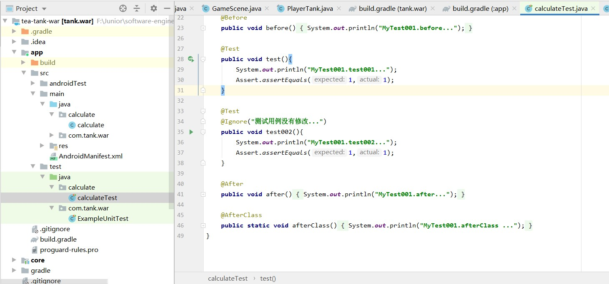
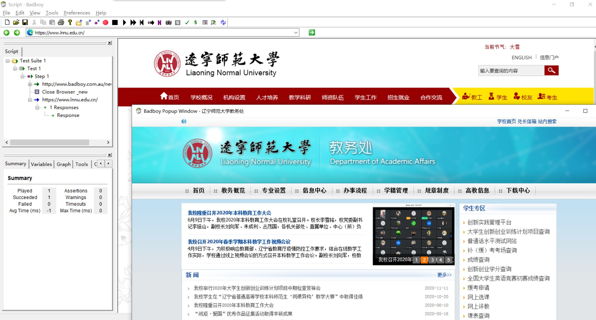
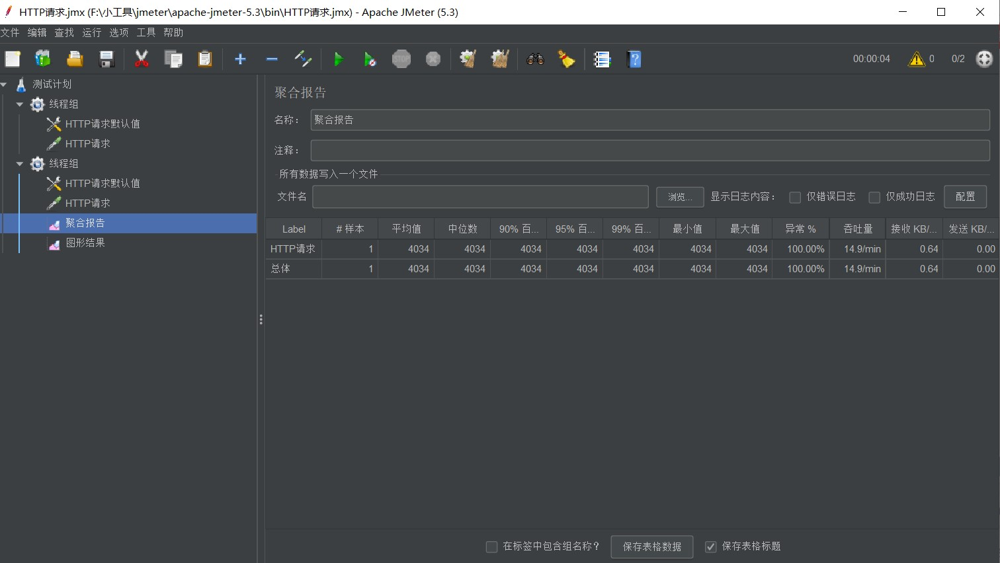
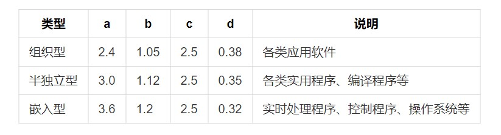
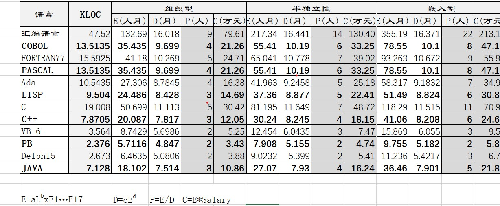
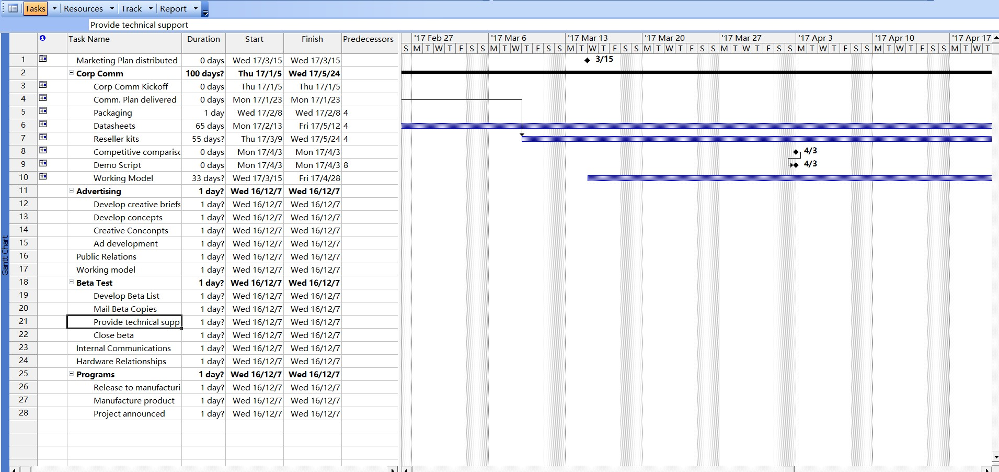

# 软件实现过程验证报告（二）

专　　业：计算机科学与技术 
班　　级：4班 


---


[toc]

### 1、引言
本次实验报告主要包含如下几个方面：
+ 用户界面设计
+ 软件实现
+ 软件测试（Jmeter、badboy、Junit）
+ 软件过程（五种模型）
+ 软件管理（COCOMO、Microsoft Office Project）
+ 实验总结

### 2、用户界面设计
人机界面设计的任务，就是根据对用户在使用交互式系统时的所作所为，或者是用户想象中的所作所为，或者是他人想象中用户的所作所为的抽象，创建或导出一致的表示界面。
设计人机界面要充分考虑到人的因素，如用户的特点、用户怎样学会与系统交互工作、用户怎样理解系统产生的输出信息以及用户对系统有什么期望等。
考虑界面的风格，可用的软、硬件技术及应用本身产生的影响。

#### 2.1 用户界面设计的问题
##### 一 、系统响应时间
系统响应时间包括两个方面：时间长度和时间的易变性。用户响应时间应该适中，系统响应时间过长，用户就会感到不安和沮丧，而响应时间过短有时会造成用户加快作节奏，从而导致错误。系统响应时间的易变性是指相对于平均响应时间的偏差。即使响应时间比较长，低的响应时间易变性也有助于用户建立稳定的节奏。
##### 二、 用户帮助设施
最好提供目前流行的联机帮助格式或HTML帮助格式。
用户可以用关键词在帮助索引中搜索所要的帮助，当然也应该提供帮助主题词。
如果没有提供书面的帮助文档的话，最好有打印帮助的功能。
在帮助中应该提供我们的技术支持方式，一旦用户难以自己解决可以方便的寻求新的帮助方式。
##### 三、错误信息的处理
在软件的开发过程中，需要对软件中存在的漏洞立即进行处理，即使一个很小的漏洞，也会造成整个软件开发系统的垃圾资源无限增多，最终可能会导致系统的瘫痪。因此在系统设计中，对拟开发系统要注意数据的约束性。为了进行数据统一收集和规范数据统一格式方面管理者的处理，针对存在的安全隐患，本项目组进行了统一约束规范。同时，项目组也应该解决Web服务器端的信息安全问题，这样才能更好的运用管理系统，从而减少系统的维修次数，确保系统的安全使用。
##### 四、命令交互
人机交互的方式最初起始于命令行交互，虽然图形界面的交互方式应用越来越广泛，可是命令行交互仍然有着它不可替代的地位。命令行交互程序是以命令行方式进行的人机交互，即用户按着程序的提示，一步步进行输入，而程序负责解释并最终执行指令。
#### 2.2 用户界面设计的基本原则
+ 可靠性 
+ 简单性
+ 易学习性和易使用性
+ 立即反馈性
#### 2.3 用户界面设计指南

##### 一、一般交互原则
+ 一致性:菜单选择、数据显示以及其它功能都应使用一致的格式。
+ 提供有意义的反馈。
+ 执行有较大破坏性的动作前要求确认。
+ 在数据录入上允许取消大多数操作。
+ 减少在动作间必须记忆的信息数量。
+ 允许用户非恶意错误，系统应保护自己不受致命操作的破坏。
+ 按功能对动作分类，并按此排列屏幕布局，设计者应提高命令和动作组织的内聚性。
+ 提供语境相关的帮助机制。
##### 二、信息显示原则
+ 只显示与当前用户语境环境有关的信息。
+ 不要用数据将用户包围，使用便于用户迅速吸取信息的方式表现信息。
+ 使用一致的标记、标准缩写和可预测的颜色，显示信息的含义应该非常明确，用户不必再参考其它信息源。
+ 产生有意义的出错信息。
+ 使用缩进和文本来辅助理解。
+ 使用窗口分隔/控件分隔不同类型的信息。
+ 高效地使用显示器的显示空间。
##### 三、数据输入原则
+ 尽量减少用户输入动作的数量;
+ 维护信息显示和数据输入的一致性;
+ 交互应该是灵活的，对键盘和鼠标输入的灵活性提供支持;
+ 在当前动作的语境中使用不合适的命令不起作用;
+ 让用户控制交互流，用户可以跳过不必要的动作、改变所需动作的顺序(如果允许的话）以及在不退出系统的情况下从错误状态中恢复;
+ 为所有输入的动作提供帮助;
+ 消除冗余输入。可能的话提供缺省值、绝不要让用户提供程序中可以自动获取或计算出来的信息。
##### 四、 web界面设计
+ 显示一致性原则：主要是指控件使用，提示信息措辞，颜色、窗口布局风格，遵循统一的标准。
+ 简洁性原则：避免使用许多复杂的图片和动画等造成用户操作的分心，界面布局应当适合清晰地表达信息，具有与之匹配的导航型。
+ 强调：美学不能取代功能
##### 五、界面中的颜色
界面中的颜色用法应保持一致，因此即使上下文发生变化，颜色也能保持统一，避免对用户造成混淆。
如果颜色信息在展示内容和状态上有冲突，例如在商标中使用红色的情况，则应避免使用它来通知错误状态。我们可以使用其他颜色（例如黄色）来避免混淆。

##### 六、Mockplus界面设计工具

使用Mockplus界面设计工具实现的界面如下所示。


### 3、 软件实现
#### 3.1  软件编码的工作
+ 程序设计
理解软件的需求说明和设计模型
补充遗漏的或剩余的详细设计
设计程序代码的结构
+ 设计审查
检查设计结果
记录发现的设计缺陷（类型、来源、严重性）
+ 编写代码
应用编码规范进行代码编写
所编写代码应该是易验证的
+ 代码走查
确认所写代码完成了所要求的工作
记录发现的代码缺陷（类型、来源、严重性）
+ 编译代码
修改代码的语法错误
测试所写代码
对代码进行单元测试
调试代码修改错误
#### 3.2  软件开发编码规范
1. 一个软件的生命周期中，80%的花费在于维护，代码规范降低了金钱成本和时间成本；
2. 几乎没有任何一个软件，在其整个生命周期中，均由最初的开发人员来维护，代码规范减少了工作交接过程中的交流成本。
3. 规范可以改善软件的可读性，可以让程序员尽快而彻底地理解新的设计和代码，节约了时间，提高了工作效率。
4. 良好的编码规范可以有效避免一些低级错误，赢得同事的夸奖和上司的认可。
#### 3.3 程序内部的文档
程序内部的文档包括意义明确的标识符、适当的注释和标准化的书写格式等。
变量名、函数名、数据结构名等具有明显的意义，可以提高程序的可读性，便于测试、维护。
注释要简明、适当和正确。序言性注释主要描述模块的功能、主要算法、接口特点，重要的数据结构说明等;与程序代码有关的注释要插在程序中对应的位置，解释有关代码的作用和必要性。
程序清单的布局要有层次性，要求结构清晰。

#### 3.4 软件代码检查
严重的：需求没有满足
很小的：不影响运行和维护
中等的：除了以上两种情况

#### 3.5 软件代码走查
+ 我的理解是代码走查与代码检查明显的区别在于：代码走查的参与者使用了计算机。
代码检查仅仅是人工阅读程序发现问题，从程序员的设计与逻辑结构分析问题，或是对照程序常见错误列表找出程序语法错误。

+ 代码最大的问题，不是一两个地方有技术缺陷，也不是业务逻辑错误，而是整个软件编写的不好。前两者都可以通过测试或使用来发现和更正，但后者就不同了。如果回想一下自己见过的各种烂摊子，是不是有同感？具体哪里有问题怎么改说不上来，就是整个软件看上去混乱无章，无从下手。
### 4、 软件测试
#### 4.1 概念
软件测试是指在规定的条件下对程序进行操作，以发现程序错误，衡量软件质量，并对其是否能满足设计要求进行评估的过程。
软件的正确性证明尚未得到根本的解决，软件测试仍是发现软件错误和缺陷的主要手段。
##### 一、测试的定义
+ 传统：测试是一项旨在评估程序或系统的属性或功能，以确定其是否满足期望结果的活动。
+ Myers：测试是执行程序或系统以发现错误的过程。
+ IEEE：测试是使用手动和自动方式运行或测试系统的过程。其目的是检查系统是否满足指定要求，或澄清预期结果与实际结果之间的差异。
##### 二、测试目的
+ 测试是为了证明程序是错误的，而不是为了证明程序没有错误；
+ 一个好的测试用例是能够找到到目前为止尚未发现的错误。
+ 成功的测试是查找到目前为止尚未发现的错误的测试。
##### 三、对软件测试的态度
+ 从用户的角度
通常希望通过软件测试来暴露软件中隐藏的错误和缺陷，以便考虑产品是否可以接受。
+ 从软件开发人员的角度
希望测试将成为一个过程，以证明软件产品中没有错误，验证软件是否正确满足了用户的要求以及建立人们对软件质量的信心。
+ 正确的态度
当发现错误时，着重于纠正错误，而不是抱怨特定的开发人员。
+ 软件测试原理
 + 软件开发人员的座右铭应该是“不断进行测试”
 + 程序员应避免检查自己的程序
 + 在设计测试用例时，它应该包括合理的输入和不合理的输入，以及各种边界条件。在特殊情况下，应创建极端状态和意外状态。
 + 在测试中要充分注意集群现象
 + 测试错误结果必须有一个确认过程
 + 制定严格的测试计划以消除测试的随机性
 + 注意回归测试的相关性，经常修改一个错误会导致更多错误
 + 妥善保管所有测试过程文件，测试重复性通常取决于测试文件
#### 4.2 测试用例
+ 测试用例是由测试数据和预期结果构成的
+ 为了发现程序中的错误，应竭力设计能暴露错误的测试用例
+ 好的测试用例是发现至今为止尚未发现的错误
+ 一次成功的测试是发现了至今尚未发现的错误的测试
#### 4.3 软件测试分类
+ 从测试阶段分：单元测试、集成测试、确认测试和系统测试
+ 从测试方法分：白盒测试、黑盒测试
+ 回归测试是指修改了旧代码后，重新进行全部或部分以前的测试用例，以确认修改没有引入新的错误或导致其他代码产生错误
##### 一、 Junit

在我们的app这个module下build.gradle已经添加了依赖

```java
testImplementation 'junit:junit:4.12'
androidTestImplementation 'androidx.test.ext:junit:1.1.1'
androidTestImplementation 'androidx.test.espresso:espresso-core:3.2.0'
```

我们在app 这个module 设置测试类calculate

然后GO TO -> Test 

Create New Test，选择路径实例化



##### 二、 badboy

它提供了强大的屏幕录制和回放功能，同时也提供了丰富的图形结果分析功能。只要不用于商业目的就可以免费使用。因此这两工具的结合，就成为了绝配。我们可以用Badboy录制脚本，然后将录制的脚本导出为JMeter格式的脚本，最后将该脚本导入到JMeter，借助于JMeter强大的测试功能模拟大量的虚拟用户，进行复杂的性能测试。



##### 三、 Jmeter

它可以用于测试静态和动态资源，例如静态文件、Java 小服务程序、CGI 脚本、Java 对象、数据库、FTP服务器， 等等。JMeter 可以用于对服务器、网络或对象模拟巨大的负载，来自不同压力类别下测试它们的强度和分析整体性能。另外，JMeter能够对应用程序做功能回归测试，通过创建带有断言的脚本来验证你的程序返回了你期望的结果。



#### 4.4 测试类型
##### 一、 动态测试
动态测试指通过运行程序发现错误，分为：
 + 黑盒测试法
 + 白盒测试法
 + 灰盒测试法
##### 二、 黑盒法
+ 黑盒测试又称为功能测试或数据驱动测试。把被测试对象看成一个黑盒子，测试人员完全不考虑程序的内部结构和处理过程，只在软件的接口处进行测试，依据需求规格说明书，检查程序是否满足功能要求
+ 常用的黑盒测试用例的设计方法：
 + 等价类划分
 + 边界值分析
 + 错误推测
 + 因果图
##### 三、 白盒法
+ 又称为结构测试、透明盒测试、逻辑驱动测试或基于代码的测试。把测试对象看作一个打开的盒子，测试人员必须了解程序的内部结构和处理过程，以检查处理过程的细节为基础，对程序中尽可能多的逻辑路径进行测试，检验内部控制结构和数据结构是否有错，实际的运行状态与预期的状态是否一致
+ 常用的白盒测试用例设计方法有：
 + 语句覆盖、判定覆盖、条件覆盖、条件判定覆盖、条件组合覆盖、路径覆盖等，发现错误的能力由弱至强
 + 语句覆盖每条语句至少执行一次
 + 判定覆盖每个判定的每个分支至少执行一次
 + 条件覆盖每个判定的每个条件应取到各种可能的值
 + 判定/条件覆盖同时满足判定覆盖条件覆盖
 + 条件组合覆盖每个判定种各条件的每一种组合至少出现一次
 + 路径覆盖使程序中每一条可能的路径至少执行一次
### 5、软件过程
#### 5.1 瀑布模型
软件生命周期分为六个阶段：软件计划，需求分析和定义，设计，实施，测试，操作和维护，并规定了它们上下固定的顺序，这些顺序彼此联系在一起，就像瀑布般逐渐落下。
优点：
+ 为项目提供按阶段划分的检查点。
+ 当前阶段完成后，您只需要关注后续阶段。
+ 瀑布模型可以应用于迭代模型。
+ 它提供了一个模板，该模板使分析，设计，编码，测试和支持方法可以在此模板下具有共同的指导。
缺点：
+ 每个阶段的划分是完全固定的，并且各个阶段之间会生成大量文档，这大大增加了工作量。
+ 由于开发模型是线性的，因此用户只能看到开发结果，直到整个过程结束为止，这增加了开发风险。
+ 通过过多的强制性完成日期和里程碑来跟踪每个项目阶段。
+ 瀑布模型的突出缺点是它无法适应用户需求的变化。
#### 5.2 增量模型：
增量模型（Incremental Model）也称为增量模型。首先，我们必须弄清用户的核心需求。
增量模型的最大特点是将要开发的软件系统模块化和组件化。基于此功能，增量模型具有以下优点。
+ 模块化要开发的软件系统，并分批提交软件产品，以便用户可以了解软件项目的进度。
+ 以组件为单位进行开发可降低软件开发的风险。开发周期中的错误不会影响整个软件系统。
+ 灵活的开发顺序。开发人员可以优先考虑组件的实现顺序，并先完成具有稳定需求的核心组件。当组件的优先级改变时，可以及时调整实施顺序。
增量模型的缺点是要开发的软件系统可以模块化。如果要开发的软件系统难以模块化，将会给增量开发带来很多麻烦。
增量模型适用于具有以下特征的软件开发项目：
+ 软件产品可以分批交付。
+ 待开发的软件系统可以模块化。
+ 软件开发人员不熟悉应用领域，并且很难一次开发系统。
+ 项目经理对全局情况有很高的了解。
#### 5.3 演化模型
适用于用户需求不清楚的情况，它是一个灵活的过程，由几个小的开发步骤完成，每个步骤都相当于需求分析设计实施和验证的经验，然后从用户的反馈中确定 下一步最终满足用户需求的开发步骤。
#### 5.4 快速原型模型
快速原型制作需要快速构建可运行的软件原型，以便理解和阐明问题，以便开发人员和用户达成共识。
#### 5.5 喷泉模型
喷泉模型的优点
+ 与瀑布模型不同，喷泉模型直到分析活动结束才开始设计活动，而编码活动在设计活动结束后才开始。模型的各个阶段没有明显的界限，开发人员可以同时进行开发。它的优点是可以提高软件项目开发的效率，节省开发时间，并适应面向对象的软件开发过程。
喷泉模型的缺点
+ 由于喷泉模型在不同的开发阶段会重叠，因此在开发过程中需要大量的开发人员，这不利于项目管理。此外，此模型要求严格管理文档，这使得审核更加困难，尤其是在可能随时添加各种信息，要求和材料的情况下。
喷泉模型：该方法也是迭代的，维护和确认设计分析的实现的过程是随时无缝且迭代的。
### 6、 软件项目管理
#### 6.1 软件项目管理概念
+ 定义：分析和管理人员产品，过程和项目的活动，目的是使软件项目能够按照预定的成本，进度和质量顺利完成。
+ 内容：主要包括以下几个方面：人员组织与管理，软件度量，软件项目计划，风险管理，软件质量保证，软件过程能力评估，软件配置管理等。
+ 这些方面贯穿并贯穿于整个软件开发过程，其中人员组织和管理着重于项目团队人员的组成和优化。软件度量侧重于使用定量方法来评估软件开发成本，生产率，进度和产品质量以及其他符合预期价值的因素，包括过程度量和产品度量；软件项目计划主要包括工作量，成本，开发时间的估算，并根据估算值制定和调整项目团队的工作；风险管理预测将来可能会损害软件产品质量的各种潜在因素，并采取措施加以预防；质量保证是一项有计划和有组织的活动，旨在确保产品和服务完全满足消费者的要求；软件过程能力评估是衡量软件开发能力的水平；软件配置管理为开发过程中人员和工具的配置和使用提出了管理策略。
#### 6.2  软件工程和软件项目管理的关系
##### 一、两者之间的区别
+ 软件工程：研究和应用如何以系统，标准化和定量的过程方法开发和维护软件
+ 项目管理：在软件开发过程中对项目的成本，人员，进度，风险和质量进行分析和控制的管理活动，以便可以根据预期的成本，进度和质量顺利完成软件工程项目，并进行改进 企业力量的效率和全面竞争。

##### 二、两者之间的关系
通过软件工程指导团队如何逐步开发，通过项目管理，管理人员可以制定软件项目计划，跟踪计划实施和控制风险。 只有将软件工程和项目管理相结合，项目才能成功地前进。
软件开发中的开发人员是最大的资源。对人员的配置、调度安排贯穿整个软件过程，人员的组织管理是否得当，是影响对软件项目质量的决定性因素。
#### 6.3 人员的组织与管理
首先在软件开发的一开始，要合理的配置人员，根据项目的工作量、所需要的专业技能，再参考各个人员的能力、性格、经验，组织一个高效、和谐的开发小组。一般来说，一个开发小组人数在5到10人之间最为合适，如果项目规模很大，可以采取层级式结构，配置若干个这样的开发小组。
在选择人员的问题上，要结合实际情况来决定是否选入一个开发组员。并不是一群高水平的程序员在一起就一定可以组成一个成功的小组。作为考察标准，技术水平、与本项目相关的技能和开发经验、以及团队工作能力都是很重要的因素。一个一天能写一万行代码但却不能与同事沟通融洽的程序员,，未必适合一个对组员之间通讯要求很高的项目。还应该考虑分工的需要,合理配置各个专项的人员比例。例如一个网站开发项目，小组中有页面美工、后台服务程序、数据库几个部分，应该合理的组织各项工作的人员配比。对于一个中型农技110网站，对数据采集量要求较高，一个人员配比方案可以是2个美工、2个后台服务程序编写、3个数据采集整理人员。

#####  一、人员组织方式
+ 民主制程序员组
+ 主程序员组
+ 现代程序员组
+ 混合方式
##### 二、民主制程序员小组
结构：团队成员完全平等，享有充分的民主，并通过协商做出技术决定
规模：小
优点：热情高，凝聚力强，有利于提高代码质量，有利于克服技术难题
劣势：人数的增加导致沟通和界面问题，成员的水平和经验必须一致，并且缺乏领导力和权威

##### 三、主程序员组
IBM在1970年代提出的建议
背景：解决民主程序员小组成员之间的矛盾，增加管理事务，降低沟通效率
结构：工作划分，分层管理
规模：中
优势：分工明确，领导核心，专职管理职位，减少沟通，提高效率
缺点：双核，不切实际的备份编程器机制，众多且底层的编程秘书事务，发现错误的热情低下

#### 6.4 项目沟通方式
+ 直接交谈
+ 电话交谈
+ 会议
+ 项目网站
+ 书面报告
#### 6.5  COCOMO 模型
1981年，Boehm提出了“建设成本模型”（CoCoMo模型）。 它是基于静态单变量模型构建的。
COCOMO模型分为三个级别：基本，中间和详细，分别用于软件开发的三个不同阶段。

##### 基本COCOMO模型

+ 基本的COCOMO模型用于系统开发的初始阶段，以估计整个系统的工作量（包括软件维护）和软件开发所需的时间。

+ 计算公式：

  + E＝aL<sup>b</sup>

  + D=cE<sup>d</sup>



例如，通过计算得到各语言的COCOMO模型



##### 中间COCOMO模型

+ 中间COCOMO模型用于估计每个子系统的工作量和开发时间。

  + E=aL<sup>b</sup>F

  + F=Π<sup>17</sup><sub>i=1</sub>Fi
+ 详细的COCOMO模型用于估计独立的软件组件，例如子系统内的各个模块。

#### 6.6 Microsoft Office Project

项目管理工具软件，凝集了许多成熟的项目管理现代理论和方法，可以帮助项目管理者实现时间、资源、成本计划、控制。

复习时间甘特图



### 实验总结

从实验一实验二，总体体会了一次软件的简单生命周期。

从软件工程的概念入手、先后介绍了面对对象方法和统一建模语言，打下基础。

接着就开始软件的周期工作，需求分析->体系结构的搭建->软件设计->软件实现->软件测试->软件管理。

通过一学期的课程设计，我深有感触。一开始对软件工程的想法非常幼稚，脑子里面只有大体的思路，没有想到分析竟然如此复杂，测试和管理更是让人头大，而现在我对软件工程的理解不再像以前那样模糊。这次课程设计对我很有帮助，离开课本，我发觉老师上课讲的很多东西是与生活紧密联系的，正如老师说的，学好软件工程对生活有大益，总的来说，过程苦难但是收获巨大。结课！

