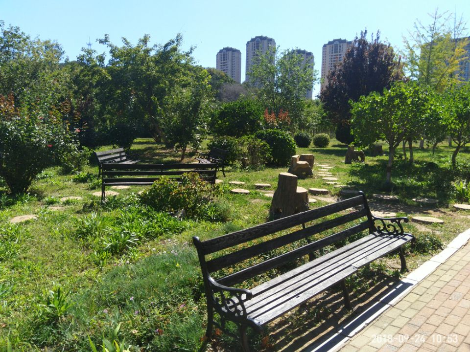

#大三以至
---
大三以至，拿起行李，坐在临近窗户的位置上，地铁外是一片赤红，就像是一幅巨大的油画，作者沾了沾橙红的染料，在天空随意的挥舞着画笔，云彩像是海浪的向你冲来，给人的感觉相当压抑。

想必这就是我们平时看到的晚霞，看着一片暗红，感叹天空的辽阔外，心中总是有点惆怅，因为它象征着太阳西坠，预示着白天就要结束了。从小到大也读了不少的语文书，我知道，这种景色最会给人无限遐想，比如面对现实、生老病死、世事沉浮。那个时候我感觉自己是一位经历世事，已然垂暮的老人，变得有点多愁善感，因为望向窗外，无论我从哪个角度向外看，全然是一片赤红。回想到现实，大学四年也已经到了第三年，就像是一天中凌晨、正午、黄昏、夜晚中的黄昏，也同样害怕着自己的学业也会步入“暮年”。

动车到站，坐上飞机，随着飞机的引擎的持续嘶吼，飞机穿过最低的云层，映入眼帘的是另一番天地，如果说天空是一张画卷，那么穿过云层后，这张画卷和刚才看到的绝然不同，作者好像有用不完的染料，染料的颜色也变得更加鲜艳，作者在这里肆意的扑撒着赤红的颜料，同时在正中央点缀着一缕金黄，不同于在地表看到的压抑的、沉默的、有点死气沉沉的昏色，现在我看到的是明亮的、夺人眼球的赤金色。被眼前这幅景象所震撼，自己的心境也同样受到巨大的冲击，就好像原本类似黄昏的死气沉沉的水面突然坠入一涌清泉，接触后在心湖产生清脆的声响，万物有声，一切都变得明朗。

飞机到站，走出舱门的那一刻，大连的风一下子就把自己吹醒。回到现实，周围人来人往，天色已经暗沉，也没有什么星光值得留恋。坐着出租车来到学校正门口，老师细心的接送，还有导员真诚的关切都让我感受到了离家的温情，回到寝室看到熟悉的面孔，去年的回忆就扑面而来。每一个人的招呼、家长的慰问、侄女和外甥女奶声奶气的语气都是最好的安慰剂。

上了一周的课，看了看每个人的情况，听了导员的一些告诫。感觉大三也是很重要的一年，专业课多，但是约束更加少了，以至于学期开头绝大多数人是松懈的，面对空闲的时间，是拿出手机打把游戏，还是打开电脑看个动漫，这成了一个问题。

有句话是态度决定一切。这里的态度如果是心态，那么好的态度能够在你遇到忧郁和悲痛的时候拽住你，使你在独木桥上保持平衡。如果这里的态度指的是人生观、世界观、价值观，那么一个好的态度是有利于人民、有利于社会、有利于自己的。不说三观能够帮助你成为多优秀的人，但是三观优秀的人对待生活、对待世界、对待是非的态度是端正的，它可以减少多数你在现实中鸡毛蒜皮的小事，可以增加自重、自立在生活中的话语权。

新的学期，新的开始，谦虚为人、谦逊待人。一个谦卑的人，内心才有真正的安息、和平、安静。

